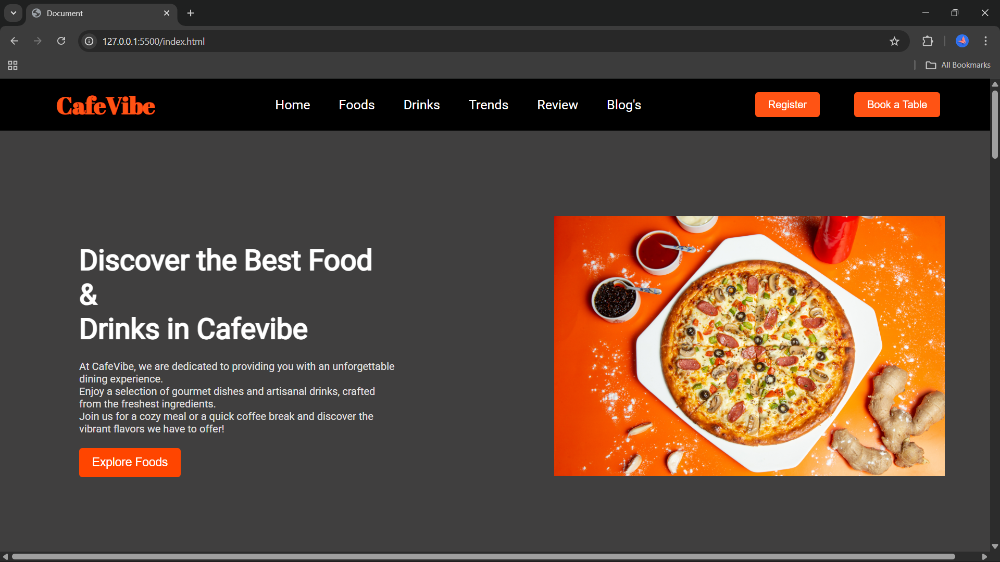
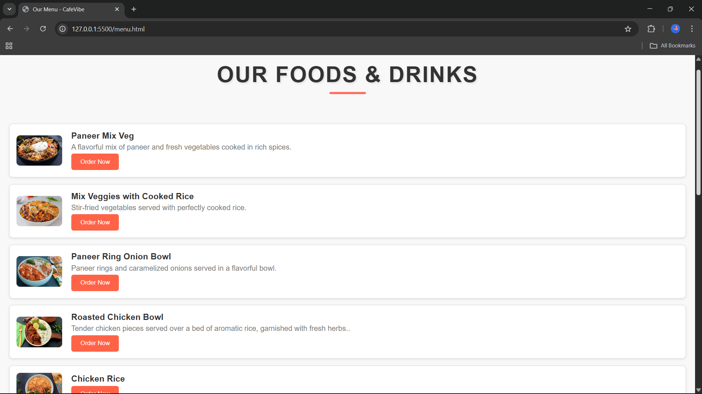
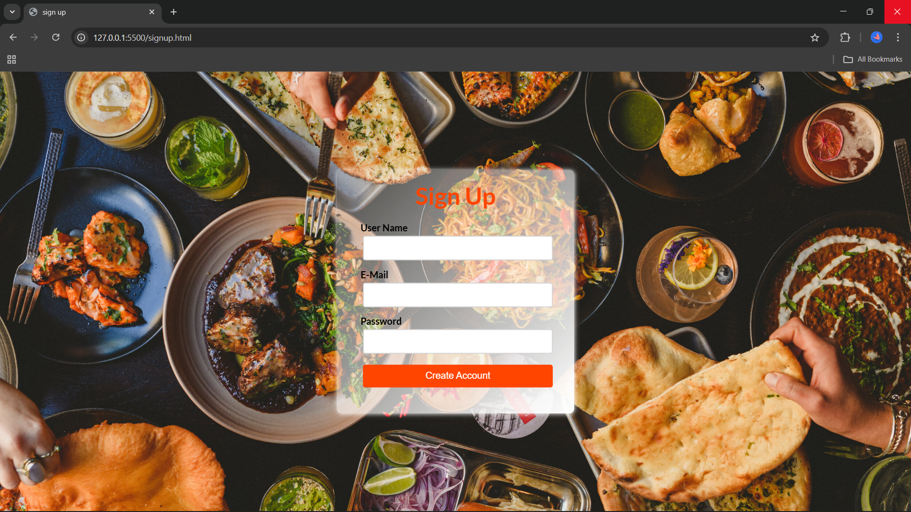

## 📌 Title and Description

**☕ Cafe Management System**

A simple and interactive web-based system for managing cafe operations. It includes features like menu browsing, table booking, and dedicated sections for Our Foods and Our Drinks, with a clean and responsive design.

## 🚀 Features

- **Home Page:** Clean and welcoming landing page with cafe introduction.  
- **Food Section:** Browse different dishes with images and order option.  
- **Drinks Section:** Wide variety of beverages with images and order option.  
- **Customer Reviews:** Showcases customer experiences and testimonials.  
- **Trending Foods:** Highlights popular food and drink items.  
- **Blog Section:** Links to food-related blogs for readers.  
- **Table Booking:** Users can reserve tables online.  
- **User Signup:** Simple signup page for new users.  
- **Responsive Design:** Works seamlessly across devices.  
## 💻 Tech Stack


- **HTML5** – Structure of the website  
- **CSS3** – Styling and layout  
- **JavaScript** – Interactivity and dynamic features  
- **Firebase** – Table booking data storage and management  
## 📸 Screenshots

### 🏠 Home Page

*Shows navbar, explore foods option and tagline.*

### 🍽️ Menu Page

*Displays Our Foods and Our Drinks.*

### 📅 Table Booking

*Booking form for reserving tables.*

### 🔑 Signup Page

*User registration page.*

## Run Locally

Follow these steps to run the project on your local machine:  

### 1. Clone the Repository  
```bash
git clone https://github.com/your-username/cafe-management-system.git
```
### 2. Navigate to Project Directory
 ```bash
 cd cafe-management-system
 ```
### 3. Open in Browser
- Simply open the index.html file in your preferred web browser.
### 4. Firebase Setup
- Create a Firebase project from Firebase Console.

- Go to Project Settings > General > Your Apps > Web App and copy the Firebase config.

- Replace the config in your firebase-config.js (or inside script section).

- Enable Firestore Database to store the bookings. 

Now your app should be running with all features locally!

## 📦 Usage/Examples

**1. Explore the Cafe**

- Open the homepage to view sections like Home, About, Services, Menu, and Reviews.

- Example: Scroll through the home page to see what the cafe offers.

**2. View Menu Items**

- Go to the Menu page to check out food and drinks.

- Example: Select Our Foods or Our Drinks to explore available options.

**3. Book a Table**

- Click on the Book a Table button in the navigation bar.

- Fill in details such as Name, Contact Number, Date, and Time to reserve a table.

**4. Read Food Blogs**

- Navigate to the Blog section to read general food-related blogs.

- Example: Discover articles about recipes, healthy eating, and food trends.
## 📚 Lessons Learned

- Learned how to design a modern and responsive UI using HTML, CSS, and JavaScript.

- Understood how to organize a multi-page website with smooth navigation between sections like Menu, Signup, and Table Booking.

- Gained practical experience in integrating Firebase for storing booking details securely.

- Improved knowledge of form handling and validation while creating the Table Booking feature.

- Explored how to link and redirect users to external food blogs through the Blog section.

- Enhanced problem-solving skills while fixing layout, responsiveness, and data storage issues.

- Learned how to write clean and structured code that is easier to maintain.
## 👩‍💻 Author
**Nishika Jaiswal**  
Aspiring Cloud & DevOps Engineer
